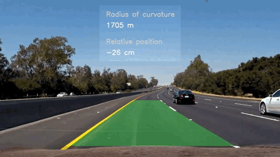
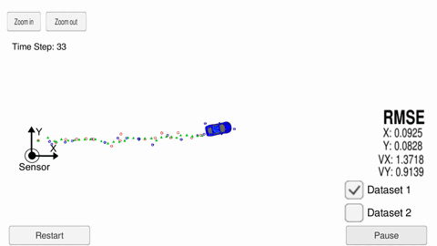
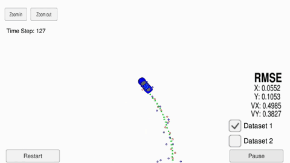

# Self-Driving Car Engineer Nanodegree
This repository contains solutions for projects of [Udacity Self-Driving Car Engineer Nanodegree](https://udacity.com/course/self-driving-car-engineer-nanodegree--nd013)
### Project 1: Finding Lane Lines on the Road
  
#### Problem
Detection of lane lines on a video
#### Solution
Using [Canny edge detector](https://en.wikipedia.org/wiki/Canny_edge_detector) and [Hough transform](https://en.wikipedia.org/wiki/Hough_transform) implementations from [OpenCV](https://opencv.org/) I extracted candidate lane lines from individual frames based on level of confidence and assumptions about spatial characteristics (position, angle and length). The final lane lines **in the individual frame** were weighted averages of the frame's candidate lines (longer candidates had larger weights). Resulting lane lines **on the video** were averages of the final lane lines from current and several previous individual frames. All variables were manually tuned  
#### Demo
Simple Case - https://youtu.be/En4_FAs5c-s  
More Advanced Case - https://youtu.be/5emFX8R4zpA  
Challenge - https://youtu.be/U8C0otDC1F8
#### Source code
[p1_lane_finding](p1_lane_finding)  
#### Keywords
`Python`, `Computer Vision`, `OpenCV`

### Project 2: Traffic Sign Classification
  
#### Problem
Classification of traffic signs
#### Solution
After some initial exploration of the dataset I augmented it by rotating images. I didn't convert to grayscale to keep color data. Not only it increased the size of training data, but also in real life traffic signs can be observed at some angle depending on relative position of the car and signs. LeNet architecture worked pretty well on augmented data. I only had to modify input and output dimensions to fit dataset. Then the model was tested on traffic signs found on the internet
#### Dataset
http://benchmark.ini.rub.de/?section=gtsrb&subsection=dataset
#### Source code
[p2_traffic_sign_classifier](p2_traffic_sign_classifier)
#### Keywords
`TensorFlow`, `Deep Learning`, `LeNet`

### Project 3: Behavioral Cloning
  
#### Problem
Cloning of the behavior of the car manually driven around the track in [Udacity simulator](https://github.com/udacity/self-driving-car-sim)  
Simulator provides two modes: training and autonomous driving. The first mode allows to drive manually in order simulate different road situations that will be used during model training. The other mode allows to simulate driving of the trained agent.
#### Solution
Using training data provided by Udacity I trained a model based on architecture from [paper "End to End Learning for Self-Driving Cars" by NVIDIA](https://arxiv.org/pdf/1604.07316v1.pdf).  
Having decent training data was the key here. Some ideas on designing training data:
- It should include not only "proper" driving along the center of the track, but also recovering from driving out of the road so that trained agent can correct its behavior in similar situations
- Data augmentation can be received virtually for free by including images from side cameras with modified angle (of course, if they are available). For example, an image from the right camera would have corresponding steering angle slightly corrected to the left hand side as if the car recovers from the driving out of the right side of the road
- Mirroring images and corresponding steering angles doubled the training dataset for free and decreases overfitting (because the track is a ring)
- Cropping irrelevant areas of the input image to focus only on the road
- One of the most important things was to decrease amount of samples with ~0° steering angle because during normal driving it was the most common situation and it overwhelmed samples with non-zero steering angle, so the agent learned to drive straight

#### Demo
https://www.youtube.com/watch?v=6txXwArfLRY
#### Source code
[p3_behavioral_cloning](p3_behavioral_cloning)
#### Keywords
`Keras`, `Data Augmentation`

### Project 4: Advanced Lane Finding
  
#### Problem
Identification of lane boundaries in a video from a front-facing camera on a car
#### Solution
I calculated camera matrix and distortion coefficients to undistort images from camera, so that calculated radius of curvature was more accurate. Instead of Canny Edge Detection approach from the Project 1, I used a combination of Sobel operators to filter relevant gradient information (related to lane boundaries) from input and output it in the form of binary (black and white) image. I used HLS color space, because it provided the most consistent results under different lighting conditions. Resulting binary image was perspective transformed to bird's-eye view to detect lane boundaries and calculate the radius of curvature as well as car's position relative to the center of the road
#### Demo
https://youtu.be/U-7ratRKlTU
#### Source code
[p4_advanced_lane_finding](p4_advanced_lane_finding)
#### Keywords
`OpenCV`, `Sobel Operator`, `Camera Calibration`

### Project 5: Vehicle Detection and Tracking
  
#### Problem
Identification and tracking vehicles moving in the same direction in a video from a front-facing camera on a car
#### Solution
Using sliding windows approach and [HOG](https://en.wikipedia.org/wiki/Histogram_of_oriented_gradients) I generated a heatmap of possible vehicle detections for each frame. For detection of a car in a window I trained Support Vector Classifier on data from [GTI Vehicle Image Database](http://www.gti.ssr.upm.es/data/Vehicle_database.html) and [KITTI Vision Benchmark Suite](http://www.cvlibs.net/datasets/kitti/). Then I filtered out detections that got less votes (dim detections on the heatmap) as probable false detections
#### Dataset
http://www.gti.ssr.upm.es/data/Vehicle_database.html  
http://www.cvlibs.net/datasets/kitti/
#### Demo
https://youtu.be/XUi7b76nXJU
#### Source code
[p5_vehicle_detection_and_tracking](p5_vehicle_detection_and_tracking)
#### Keywords
`Computer Vision`, `Support Vector Classifier`, `Histogram of Oriented Gradients`, `Sliding Windows`

### Project 6: Extended Kalman Filters
  
#### Problem
Tracking a moving object using simulated radar and lidar data
#### Solution
In this project, goals were to get familiar with C++ and implement Extended Kalman Filter using it. Based on simulated measurements of object moving around a vehicle I used Extended Kalman Filter to track the object's position.
#### Demo
https://youtu.be/36X1QxnA8m0
#### Source code
[p6_extended_kalman_filters](p6_extended_kalman_filters)
#### Keywords
`C++`, `Extended Kalman Filter`, `Constant Velocity model (CV)`

### Project 7: Unscented Kalman Filters
  
#### Problem
Improvement of tracking a nonlinearily moving object using Unscented Kalman Filter
#### Solution
Solution in the last project assumed that the tracked object kept going straight (Constant Velocity model). Because of that when the object turned, its estimated position tended to result outside of the actually driven circle. In this project, I implemented Unscented Kalman Filter using Constant Turn Rate and Velocity model (CTRV) to track nonlinearily moving object
#### Demo
https://youtu.be/bSmcUqRlyD0
#### Source code
[p7_unscented_kalman_filters](p7_unscented_kalman_filters)
#### Keywords
`Unscented Kalman Filter`, `Constant Turn Rate and Velocity model (CTRV)`
