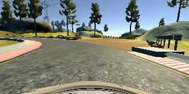
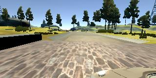
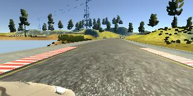

## Structure of the Network
I used the model described in NVIDIA's "End to End Learning for Self-Driving Cars" as base model for this project. Initially my car was not able to travel even the first curve, so I read a lot of forum threads related to this project. I discovered that the model can be trained with input stream as small as 32 x 16 px. For this reason, I decided to resize input images using average pooling with pool and stride size of (2, 2) as a first layer after batch normalization and cropping.

Trees and other objects above the road are important factors in real life. However, for the purposes of this project I assumed that road marking is sufficient info to predict steering angle (it later was confirmed by testing). So I decided to crop 80 pixels at the top (sky, tress, rocks) and 20 pixels at the bottom of the image (hood) that had great variability but presumably didn't add a lot of useful information. I decided to crop more at the top because it leaded to faster training. I thought in case the model wasn't not converging I would decrease number of pixels cropped. But I hadn't had to do it because the model worked great with chosen values.

Cropping and average pooling leaded to smaller input size than in NVIDIA's model. For this reason I had to decrease number of convolutional layers because images simply didn't have enough height. First convolutional layer in NVIDIA's model had input size of 66x200. After cropping and resizing, size of the input for the first convolutional layer in my model was 30x160.

The network consists of 12 layers as follows:

#### Preprocessing layers
1. Non-trainable batch normalization
2. Cropping as discussed above to remove unimportant (for this project) details. 80 pixels at the top and 20 pixels at the bottom were cropped.
3. Average pooling to resize input for the first convolutional layer with pool size of (2, 2)

#### Convolutional layers and MaxPooling
4. 24 5x5 kernels
5. MaxPooling with stride (2, 2)
6. 36 5x5 kernels
7. MaxPooling with stride (2, 2)
8. 48 3x3 kernels
9. MaxPooling with stride (2, 2)

#### Fully connected layers
10. 100 neurons with ELU activation and dropout with probability of 0.25
11. 50 neurons with ELU activation and dropout with probability of 0.25
12. 10 neurons with ELU activation and dropout with probability of 0.25

The output layer had 1 neuron and used Linear activation because desired output is a single value in range of [-1, 1]
As in the NVIDIA's paper convolutional layers were used for feature extraction. Instead of strides of (2, 2) I used strides of (1, 1) for convolutional layers. I added MaxPooling after each convolutional layer because the road didn't have a lot of complex details so I felt I could decrease dimensionality even more without loosing too much info. Also I should note that since the road is not complex (in the visible area the most complex figure is a curve), network don't have to be very deep either. 2-4 convolutional layers for such features seemed to be enough in comparison to driving in the real world where more convolutional layers seemed to be required. I also experimented with removing fully connected layers. And I stopped experimenting with them after training time became relatively small, but autonomous driving was still good. I used Dropout layers to reduce overfitting.

I used Adam optimizer because it often gives good results by default. For loss I used MSE. On the one hand the problem is regression, so MSE is a good option. But on the other hand, in the beginning I got a very low validation loss, but poor performance on the track, so MSE was not perfect indicator of model's performance.

I didn't really look at training, validation and test losses much, because after I implemented that monstrous data import function I was able to iterate very quickly and test the model in simulator. After 3-4 iterations the car started decently travel along the track.

However by comparing training, validation and test losses I can conclude that model is not overfitting because test error is very close to training error.

I used batch size of 256 and 7 epochs. It was enough for successful training of the model without overfitting.

## Data preprocessing
I believe it was one of the most important parts of this Project because initially I didn't control skew and mean steering angle of the dataset as well as a portion of zero steering angle examples. It leaded to terrible performance during autonomous driving even if the loss was very small. So I researched ideas on forum and in related Papers and tried most promising ideas. Majority of them are summarized in this topic: https://carnd-forums.udacity.com/questions/26214464/behavioral-cloning-cheatsheet

One of the first problems I faced was that the car didn't change angle during autonomous driving. And almost always this angle was very close to 0. So after reading the forum I decided to add control over portion of examples with steering angle equal 0 that go to the training set. I decreased it so that distribution of steering angles started look closer to the normal distribution.At the same time I generated additional data by mirroring all images and corresponding angles. These two ideas helped me to decently balance the training data.

Another idea introduced in the project description helped me to generate even more training data using images from left and right cameras. Because left and right camera images were shifted in comparison to center camera images, by correcting angle I added more data that worked as recovery data.

Because I had little success in the beginning with my own poorly collected data and poorly architectured model, I decided to use Udacity data.

As a result training data consisted of both images of the car following along the center of the track and the data that worked as recovery data (images from side cameras).

### Examples of images
#### Image from the center camera

#### Image from the left camera on the bridge

#### Image from the right camera at yet another location

## Reflections
Reading forums and NVIDIA paper helped the most.
I didn't use generator because I had enough RAM.
